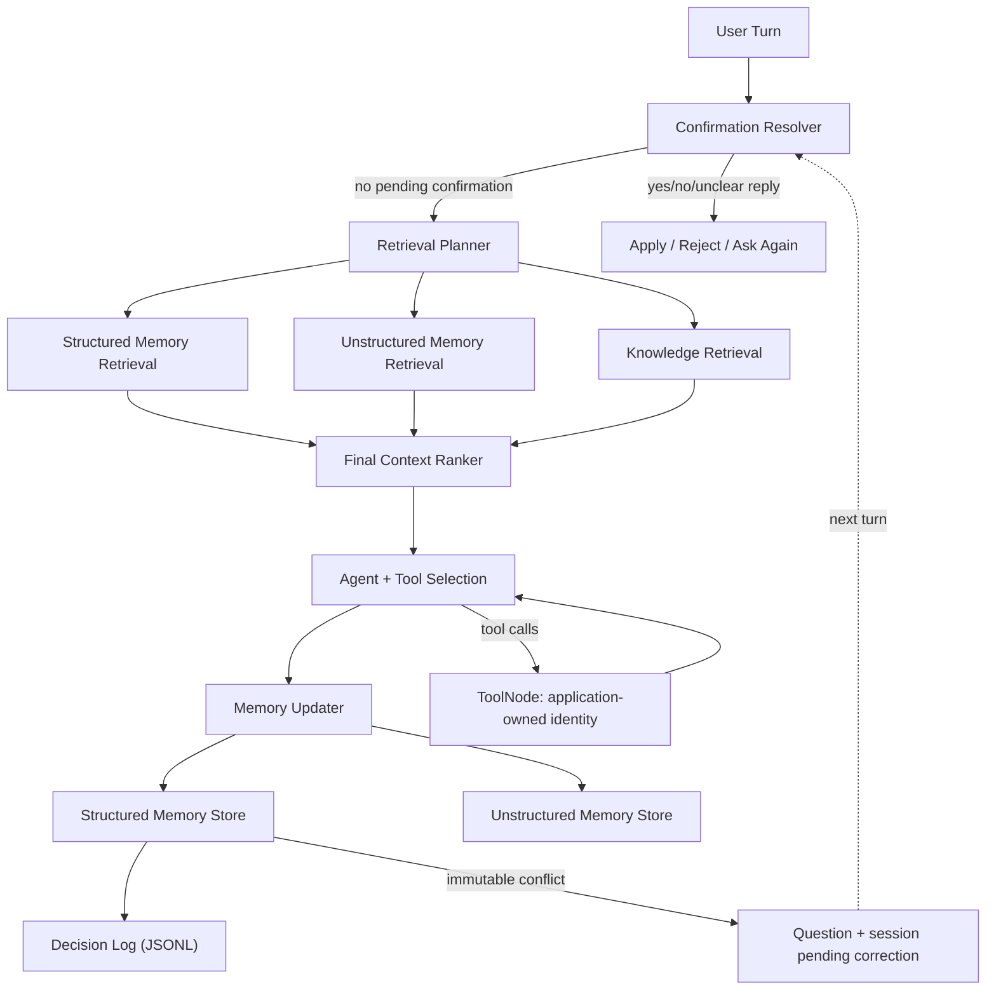

# Stateful Agent

A local, memory-aware CLI assistant built with LangGraph, OpenRouter, JSON persistence, and Chroma retrieval.

The focus is application-owned memory: the model proposes facts and retrieval plans, while deterministic code validates writes, scopes access to a local profile, and requires confirmation before correcting a saved birthdate. This is a single-process portfolio application, not a production multi-user service.

## What This Project Demonstrates

- Separating LLM suggestions from validated persistence and tool execution.
- Combining structured facts, semantic memory, and short-lived conversation state.
- Explicit immutable corrections with ownership and previous-value checks.
- Fail-closed retrieval boundaries, atomic JSON replacement, and best-effort audit metadata.
- Testing the compiled agent graph offline with a scripted provider and isolated storage.

## Demo Highlights

The [demo script](demo_script.md) covers:

- saving a birthdate as structured memory
- remembering that birthdate later and deriving age from it
- storing food and health preferences
- using saved preferences in a recommendation
- triggering an immutable-memory conflict on a write-once field
- resolving that conflict explicitly with `yes` or `no`

## Architecture Overview



Five tools are available: `calculator`, `get_current_time`, `get_current_age`,
`get_user_info`, and `semantic_scholar_search`. Tool selection is model-driven;
the calculator and age derivation are deterministic. Semantic Scholar is a live
HTTP tool with a 10-second per-request timeout.

## Project Structure

```text
app/
  core/           settings and logging
  db/             lazy vectorstore setup
  llm/            model client, prompts, extraction helpers
  models/         memory schema and domain constants
  repositories/   JSON persistence and decision logging
  schemas/        shared state types
  services/       graph, chat loop, memory, retrieval, tools
  utils/          reusable helpers
tests/            offline unit and integration-style tests
main.py           CLI entry point
demo_script.md    guided CLI demonstration
```

## Memory System

The agent uses two kinds of memory:

### Structured memory

Stored in local JSON and used for stable facts such as:

- `birthdate`
- `favorite_food`
- `diet`
- `current_goal` (under `dynamic`)
- `weight`

The canonical schema is in [app/models/memory.py](app/models/memory.py).
Structured retrieval filters stored keys deterministically; the plan choosing
those keys still comes from the model. Age uses `calculate_age_from_birthdate`,
not a saved age that would become stale.

`goal` and `target_weight` are session-only working-memory keys. They are not
structured-storage fields; the persistent goal field is `dynamic.current_goal`.
The two schemas intentionally serve different lifetimes.

### Unstructured memory

Stored in Chroma and used for softer context such as:

- dislikes
- habits
- preferences
- background context

### Immutable memory handling

`birthdate` is the currently supported immutable schema field:

- if missing, they can be stored
- if the same value appears again, nothing changes
- if a different value appears later, the agent asks for confirmation
- confirmed changes are applied only through the dedicated confirmation resolver

The extractor proposes corrections; application code decides whether to store or
request confirmation. Pending corrections carry the active owner ID. The resolver
rechecks ownership, field/category, value validity, and the exact previous value
before applying a correction. Mutable fields cannot use this correction path.

Birthdate candidates must be valid ISO calendar dates, not future dates. The
conversation write path conservatively requires a matching first-person statement,
such as `I was born on 1995-04-12.` or `Actually, my birthdate is 1996-04-12.`
Quoted, third-person, hypothetical, and more complex phrasings are skipped rather
than guessed. Only the user's message enters persistent-memory extraction.

### Local identity and trust

The single-user CLI uses `local-user` across restarts. Set
`STATEFUL_AGENT_USER_ID` to choose another local profile. To continue a profile
created by the earlier random-ID version, set it to that existing owner's JSON key;
old records are not automatically merged. An empty configured ID fails at startup.
This is profile selection for a trusted local operator, not authentication.

LangGraph injects application state into the age and memory tools. Their model
schemas contain no owner ID, and model-supplied runtime values are replaced by
trusted state. The age tool derives age from birthdate through the calendar helper,
not a cached age. Pending confirmations last only for the current CLI session.

Retrieved and working memory are passed as untrusted user-role context, never as
system instructions. Invalid ranker output yields no context for the affected
category; complete failures yield empty context. Valid selections remain limited
to retrieved items. These boundaries do not guarantee factual extraction or
eliminate all prompt-injection risks.

### Retrieval and distances

Unstructured retrieval enforces both owner and requested memory types in Chroma
metadata filters, then checks them again on returned records. Untyped legacy
records are not included in explicitly typed requests. The collections use
Chroma's default `l2` distance; smaller distances are closer, not probabilities.
Knowledge results expose raw `distance`. Unstructured results also expose a
`ranking_cost`: 70% raw distance plus 30% recency penalty, an uncalibrated heuristic.
Duplicate detection uses a raw-distance cutoff of `0.15`, also a heuristic.

Knowledge retrieval still runs on every normal turn. This is a small-demo
trade-off: the planner scopes user memory, while the bounded final ranker selects
knowledge alongside it. No new routing heuristic is introduced. Confirmation
replies bypass retrieval. A fresh core collection is empty until explicitly populated.
The final ranker can select at most five upstream items per category and cannot
invent or duplicate items. These bounds do not limit the separate session history.

### Persistence and logs

Runtime files live under project-root `data/`, regardless of the launch directory:

- `user_info.json`: structured profiles, including raw personal values.
- `user_memory/` and `core_knowledge/`: local Chroma persistence.
- `memory_decision_log.jsonl`: timestamp, user ID, schema field/category, decision,
  reason, source, and `has_existing_value` / `has_proposed_value` flags.

JSON updates write a temporary file, flush and sync it, close it, then use
`os.replace`. Corrupt or structurally invalid existing files fail explicitly and
are preserved, never treated as empty memory. Back up and inspect such a file
before repairing it. The CLI checks the store before initializing clients.
Failed writes during a conversation also add a storage-error notice to the reply.

Audit appends are best-effort: failure emits an error but does not undo or misreport
a successful memory write. New audit entries omit raw values; in-memory results
and pending confirmations retain them for the resolver. Normal application logs
use counts/status instead of copying conversations. CLI answers remain visible.
Existing logs are not rewritten; old entries and exception diagnostics may still
contain personal data. This is data minimization, not a redaction/compliance system.

## Testing Strategy

After installing dependencies, the tests need no API key, model download, or network.

The test suite covers:

- structured memory persistence
- immutable overwrite protection
- confirmation and correction flow
- decision logging
- retrieval relevance
- retrieval planner robustness
- final context/ranking safety
- lazy initialization and import safety
- malformed extraction batches, structured-value validation, and owner isolation
- compiled-graph tool execution with attempted model-supplied owner IDs
- a scripted-provider conversation that stores a birthdate, handles an unrelated
  turn, proposes a correction, processes unclear/yes/no replies, and retrieves the
  stored value with conversation history cleared
- corrupt-file preservation, atomic-write failures, and audit-failure independence
- owner/type filters, raw-distance ordering, and bounded calculator operations

The tests are intentionally offline:

- no live OpenRouter calls
- no live Hugging Face calls
- no live network access
- vectorstore-dependent behavior is mocked where determinism matters

Tests replace model responses while exercising the real extractors, JSON parsing,
graph, ToolNode, repositories, and confirmation resolver in the showcase tests.
They prove orchestration and deterministic checks, not live model accuracy or
semantic vector-search quality. Test fixtures isolate memory files and block
socket connections. Live demo wording and extraction remain model-dependent.

## Setup

Use Python 3.13. From the cloned repository root on macOS/Linux:

```bash
python3.13 -m venv .venv
./.venv/bin/python -m pip install --upgrade pip
./.venv/bin/python -m pip install -r requirements.txt
./.venv/bin/python -m pytest -q
```

On Windows, create the venv with `py -3.13 -m venv .venv` and use
`.venv\Scripts\python.exe` instead of `./.venv/bin/python`.
Installation needs internet and includes the relatively large embedding/PyTorch
stack. Direct dependencies are pinned; transitive dependencies are not fully locked.

For the **live CLI**, create the local config:

```bash
cp .env.example .env
```

Set `OPENROUTER_API_KEY` in `.env` to your own OpenRouter key. The only supported
provider is OpenRouter, with `openai/gpt-3.5-turbo` selected in
[settings](app/core/settings.py). `OPENAI_API_KEY` is not a fallback and does not
select a separate OpenAI provider. Missing configuration fails at CLI startup
before embeddings initialize; plain imports remain lazy and do not require keys.

`HF_TOKEN` is optional for authenticated Hugging Face downloads; leave it unset
rather than supplying the placeholder. The embedding model is `BAAI/bge-large-en`.
`STATEFUL_AGENT_USER_ID` defaults to `local-user`; use a distinct, non-personal
profile ID for a demo. Existing environment variables take precedence over `.env`.

## Run Locally

```bash
./.venv/bin/python main.py
```

Exit with `quit` or `exit`. Initial startup may download the embedding model;
warm it up before presenting. Live requests incur provider costs and depend on
network, model availability, and model output. Nothing in the offline suite
guarantees a particular live response.

## Run the Demo

Follow [demo_script.md](demo_script.md) with fictitious facts. It exercises both
rejection and acceptance in one session. For a deterministic demonstration without
credentials, run `./.venv/bin/python -m pytest -q tests/test_showcase_graph.py`.

## Example Conversation

```text
You: I was born on 1995-04-12.
You: I dislike pork and I am trying to lose weight.
You: What should I cook today?
AI: ... recommendation shaped by dislike + goal ...

You: How old am I?
AI: ... derived from the stored birthdate ...

You: Actually my birthdate is 1996-04-12.
AI: I currently have 1995-04-12 saved as your birthdate. Do you want me to replace it with 1996-04-12?
You: no
AI: Okay, I kept your birthdate as 1995-04-12.
```

This is an illustrative flow, not a recorded live transcript. Confirmation text
is generated by application code once a conflict reaches storage; extraction,
recommendations, and age-tool selection remain model-dependent.

## Optional Document Ingestion

The base CLI does not load a source-document folder. The Python helper
`app.db.vectorstores.ingest_knowledge(..., doc_folder=...)` can ingest local `.txt`
files through `DirectoryLoader`. This optional path additionally requires
`./.venv/bin/python -m pip install unstructured`; it is intentionally not in the
base requirements. Install and validate the optional parser in your environment
before using it. The tests mock document loading, not the parser installation.

Call the helper with `CORE_KNOWLEDGE_DIR`, `CORE_KNOWLEDGE_COLLECTION`, and a trusted
document folder. Leave `force_rebuild=False`: rebuilding deletes the specified
store directory. Repeated folder ingestion can duplicate documents. No ingestion
CLI, packaged knowledge corpus, or extra provider is included.

## CI

The repo includes a GitHub Actions workflow that:

- installs dependencies
- runs `pytest`
- runs `py_compile`

Equivalent local checks:

```bash
./.venv/bin/python -m pytest -q
./.venv/bin/python -m py_compile main.py $(find app tests -name '*.py')
./.venv/bin/python -c "import main; print('import-main-ok')"
```

## Limitations

- Local trusted-profile selection is not authentication or multi-tenant isolation.
- Atomic replacement prevents partial writes, not concurrent lost updates. There
  is no file locking, cross-store transaction, or transactional audit outbox.
- Pending confirmation and history are session-only; restart preserves saved
  facts but discards pending corrections. History is not size-bounded.
- Only conservative first-person ISO birthdate statements are accepted. Other
  fact extraction and semantic relevance still need live evaluation.
- JSON/Chroma memory is not encrypted. Keep `.env`, `data/`, and logs private;
  they are ignored by Git. The placeholder-only `.env.example` is shareable.
- No software license has been selected yet.
